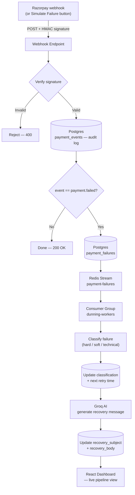

# Smart Dunning Engine

An AI-powered payment recovery system for subscription businesses — built for the Razorpay AI Buildathon.

## The problem

When a subscription's auto-debit fails (expired card, insufficient funds, a gateway hiccup), most systems retry blindly — same schedule, regardless of *why* the payment failed. That costs businesses real, recoverable revenue and quietly churns customers who never even see a helpful nudge.

## What this does

Smart Dunning Engine listens for payment-failure webhooks, figures out *why* the payment failed, decides a smart retry strategy based on that reason, and uses AI to draft a personalized, context-aware recovery message — instead of one generic "your payment failed" email for every case. A live dashboard shows the entire recovery pipeline in action, including a self-serve "Simulate Failure" button so anyone can trigger and watch the full pipeline run without needing terminal access.

## Architecture



## How classification works

Every failed payment is bucketed by matching its error code/reason/description against known patterns:

| Classification | Meaning | Retry strategy |
|---|---|---|
| `hard_decline` | Card expired, blocked, invalid | No auto-retry — customer must update payment method |
| `soft_decline` | Insufficient funds, issuer declined | Retry with escalating gaps (1 day → 3 days → 7 days) |
| `technical_glitch` | Gateway timeout, server error | Fast retry (30 min) — not the customer's fault |
| `unknown` | Insufficient data to classify | Safe 24h fallback, generic message |

Classification is persisted **independently** of AI message generation — if the AI provider has a hiccup, the business-critical classification and retry schedule are never blocked or lost.

## Tech stack

- **Backend:** Node.js, TypeScript, Express
- **Queue:** Redis Streams (consumer groups, at-least-once delivery)
- **Database:** PostgreSQL
- **AI:** Groq (`openai/gpt-oss-20b`) for recovery message generation, JSON-structured output with graceful fallback
- **Frontend:** React, Vite, TypeScript, Tailwind CSS, Framer Motion, Recharts
- **Infra:** Docker Compose (local Redis + Postgres, persistent volume)

## Project structure

```
dunning_engine/
├── src/
│   ├── server.ts              # Express entry point
│   ├── config/env.ts          # Centralized environment loading
│   ├── webhooks/
│   │   ├── razorpay.routes.ts # Webhook receiver + orchestration
│   │   └── verifySignature.ts # HMAC-SHA256 signature verification
│   ├── queue/
│   │   ├── redisClient.ts
│   │   ├── producer.ts        # Pushes failures onto the stream
│   │   └── consumer.ts        # Consumer group: classify + generate
│   ├── classification/
│   │   └── classifyFailure.ts # Rule-based classifier + retry scheduler
│   ├── ai/
│   │   └── groqClient.ts      # Recovery message generation (Groq)
│   ├── db/
│   │   ├── client.ts
│   │   └── schema.sql
│   └── api/
│       └── failure.routes.ts  # GET /api/failures, POST /api/simulate
├── dashboard/                  # React + Vite frontend
├── docker-compose.yml
└── package.json
```

## Running it locally

**Prerequisites:** Node.js 18+, pnpm, Docker Desktop

```bash
# 1. Install dependencies
pnpm install

# 2. Start Redis + Postgres
docker compose up -d

# 3. Apply the database schema
docker cp src/db/schema.sql $(docker ps -qf "ancestor=postgres:16-alpine"):/schema.sql
docker exec -it $(docker ps -qf "ancestor=postgres:16-alpine") psql -U dunning -d dunning_engine -f /schema.sql

# 4. Set environment variables — create a .env file:
#    RAZORPAY_WEBHOOK_SECRET=<your test secret>
#    GROQ_API_KEY=<your Groq API key>
#    DB_HOST=localhost
#    DB_PORT=5432
#    DB_USER=<DB_USER>
#    DB_PASSWORD=<DB_PASSWORD>
#    DB_NAME=<DB_NAME>

# 5. Start the backend (Terminal 1)
pnpm dev

# 6. Start the consumer worker (Terminal 2)
pnpm consumer

# 7. Start the dashboard (Terminal 3)
cd dashboard && pnpm dev
```

Dashboard runs at `http://localhost:5173`. Backend at `http://localhost:3000`.

## Trying it out — no terminal required

The dashboard has a **"Simulate Failure"** button in the header. Clicking it sends a randomly-chosen failure event through the exact same code path a real Razorpay webhook would use — the engine independently verifies, persists, classifies, and drafts a recovery message for it. This makes the whole pipeline demoable by anyone, not just from a developer's terminal.

For local testing without the UI, the same thing can be triggered via `node send-test-failure.js`, or by manually signing a payload:

```bash
node test-signature.js
curl -X POST http://localhost:3000/webhooks/razorpay \
  -H "Content-Type: application/json" \
  -H "X-Razorpay-Signature: <signature from above>" \
  --data-binary @test-payload.json
```

## Design decisions worth knowing

- **Audit log vs. business state, separated.** `payment_events` is append-only raw truth; `payment_failures` is mutable state that evolves (`received` → `classified` → `message_ready`). This mirrors how real payment systems separate immutable logs from evolving records.
- **Idempotency by design.** `ON CONFLICT (razorpay_payment_id) DO NOTHING` means a webhook delivered twice (which providers do, by design, for reliability) never creates duplicate records.
- **AI failure isolation.** Classification and retry scheduling are committed to the database before the AI call runs, so a flaky AI provider degrades gracefully instead of losing business-critical state.
- **Provider-agnostic AI layer.** The message-generation function has a stable interface; the project switched from Claude to Groq mid-build by changing a single file.
- **Raw-byte signature verification.** Signatures are verified against the original request buffer (captured via Express's `verify` hook), not a re-serialized JSON body — a subtle but important correctness requirement for HMAC verification.

### Note on live webhook integration

Attempted full integration twice with independent subscriptions: a fresh Razorpay test account, eMandate authentication (both payments succeeded through Razorpay's own checkout flow), an ngrok tunnel, and webhook registration. In both cases, the subscription's `auth_attempts` and `paid_count` remained at 0 at the API level despite a completed payment — a reproducible platform-side inconsistency in this account's test-mode subscription activation, outside our control. Reverted to a signed-request simulator (exposed in the dashboard as "Simulate Failure") that exercises the identical code path, including real HMAC signature verification.

## What's next

- Connect to a live Razorpay subscription webhook once the platform-side test-mode activation issue is resolved
- Dead-letter queue + exponential backoff for message-processing failures (pattern already proven in an earlier project, deliberately deferred here for scope)
- WhatsApp delivery channel for recovery messages, alongside email